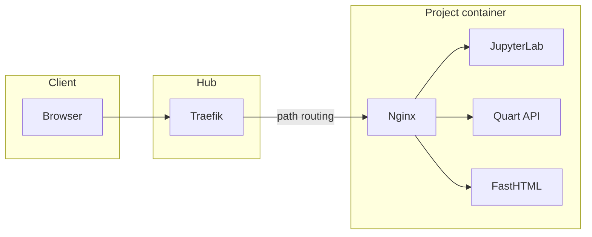

# Katapult

Katapult creates an isolated development environment that can be
configured to include a [JupyterHub](https://jupyter.org/hub) server,
a [Quart](https://palletsprojects.com/projects/quart) api service,
a [fasthtml](https://www.fastht.ml/) webapp, and the template for a python library.
In addition, [Quarto](https://quarto.org/) is used to create static websites that
integrate easily with github pages and provide downloadable html files of
jupyter notebooks.

[view on github pages](https://ajp619.github.io/katapult/)

## Description

Katapult creates an isolated environment for each project that is easily
portable from your laptop to any network infrastructure. It provides a single container
that has the following tools:

* [JupyterHub](https://jupyter.org/hub) / **JupyterLab**: Explore data, prototype transformations
  and models, and make publishable reports.
* [Quart](https://palletsprojects.com/projects/quart): Create an api that allows
  programmatic access to information generated by your service.
* [fasthtml](https://www.fastht.ml/): Create dashboards and tools to help others
  gain insight from your work.
* [Quarto](https://quarto.org/): Publish stand alone, interactive reports that can be
  downloaded and distributed in various formats. Create project documentation using
  Markdown and Jupyter.
* **Nginx**: Acts as a reverse proxy within the container to route requests to the appropriate services.

It takes an opinionated view of the typical development process and provides many
convenience functions to facilitate this process.

## Architecture

1. **Hub container (Traefik)**: A central Traefik reverse proxy container routes requests to individual projects via path-based routing (e.g. `http://localhost/project_name/`).
2. **Project containers**: Each project runs in its own Docker container with all services managed by Supervisor.
3. **Docker networking**: Projects connect to a shared `katapult` Docker network for automatic routing.



## Getting Started

### Dependencies

* *nix environment (e.g. linux, macOS). On Windows use wsl2.
* docker
* Python 3.12
* pipx

### Installing

Install from github:

```bash
pipx install "git+https://github.com/ajp619/katapult#subdirectory=lib"
```

### Quickstart

Enable `katx` (see [CLI Reference](#cli-reference)):

```bash
kat config
```

Launch entry point container:

```bash
kat hub
```

Create a new project from the katapult template with:

```bash
kat init
```

Enter the project name and accept the rest of the defaults. This will create a
new directory for your project.

Change to the new project directory and use:

```bash
katx run
```

This will build the container, launch it, render the static content, and show you the
status of the services.

You can now access the container at `http://localhost/<project name>/`

## CLI Reference

There are two commands: `kat` and `katx`.

### `kat` (high-level management)

Use `kat` for creating projects and managing the hub container that exposes all projects
as path extensions (e.g. `http://localhost/<project name>/`).

| Command | Description |
| --- | --- |
| `kat init` | Creates a new project from a cookiecutter template |
| `kat hub` | Manages the Traefik reverse proxy container |
| `kat config` | Sets up dynamic PATH augmentation for `katx` in `.bashrc` (see [`kat config`](srv/kat.qmd#kat-config)) |

```bash
kat --help
```

### `katx` (project-level management)

`katx` manages each individual project. Enable it with `kat config`; that adds code to your
`.bashrc` so `katx` is on your PATH when you enter a project directory.

| Command | Description |
| --- | --- |
| `katx run` | Builds the container, starts services, renders static content, and shows status |
| `katx build` | Builds the Docker image |
| `katx up` | Starts services via docker-compose |
| `katx down` | Stops services |
| `katx connect` | Opens a shell in the container |
| `katx render` | Renders Quarto documentation |
| `katx status` | Shows service status via supervisorctl |
| `katx jlab` | Lists JupyterLab access URLs with tokens |
| `katx restart` / `katx rebuild` | Shortcuts for down, build, up |

From within the project directory or a subfolder:

```bash
katx --help
```

## Project Structure

Each generated project contains:

* `api/` — Quart API service code
* `app/` — FastHTML webapp code
* `lib/` — Python library code
* `nbk/` — Jupyter notebooks directory
* `build/` — Docker configuration (Dockerfile, docker-compose.yml, supervisor configs)
* `.katapult/` — Contains the `katx` script (dynamically added to PATH when in the project directory)
* `srv/` — Quarto documentation source files
* `docs/` — Rendered documentation output

## Service Management

Services within each container are managed by **Supervisor**, which runs:

* JupyterLab server
* Quart API server
* FastHTML webapp
* Nginx reverse proxy

All services are reachable through the unified interface at `http://localhost/<project_name>/` with different paths for each service.

## Key Features

* **Isolated environments**: Each project runs in its own container, portable from laptop to network infrastructure
* **Opinionated structure**: Convenience functions aligned with a typical development workflow
* **Single container**: All services run in one container per project
* **Automatic routing**: Traefik discovers and routes to new projects
* **Dynamic PATH**: The `katx` command is available when you enter a project directory

## Version History

* 0.1
  * Initial Release

## License

This project is licensed under the MIT License - see the LICENSE.md file for details
